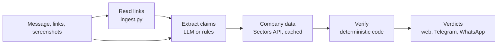

# Neraca Fakta · Fact Ledger

**Every stock claim, verified against official data.**

Stock tips spread fast in Indonesia: forwarded WhatsApp messages, Telegram groups, TikTok
captions, YouTube videos, Instagram screenshots. Many quote numbers ("laba naik 200%!",
"dividen yield 12%") that nobody checks. Neraca Fakta takes the tip in whatever form it arrives
(a chat message, a link, or a screenshot), pulls out each numeric claim, and checks it against
the company's reported figures on the Indonesia Stock Exchange (IDX), using the
[Sectors Financial API](https://docs.sectors.app).

Built for **Sectors Hackathon 2026, Track 1**. Bilingual: Bahasa Indonesia and English.

**Live demo: [neraca-fakta.vercel.app](https://neraca-fakta.vercel.app)** (offline data for BBCA,
GOTO and TLKM; uses no API credits).

> Information tool only. Not investment advice. Price predictions can't be verified and are not graded.

---

## Contents
- [What it does](#what-it-does)
- [How it works](#how-it-works)
- [Quick start](#quick-start)
- [Configuration](#configuration)
- [AI providers](#ai-providers)
- [Links and screenshots](#links-and-screenshots)
- [Market panels](#market-panels)
- [Chat bots: Telegram and WhatsApp](#chat-bots-telegram-and-whatsapp)
- [HTTP API](#http-api)
- [Sectors credit budget](#sectors-credit-budget)
- [Project structure](#project-structure)
- [Development and testing](#development-and-testing)
- [Deploying to Vercel](#deploying-to-vercel)
- [Known limitations](#known-limitations)
- [Data sources](#data-sources)

---

## What it does

**Checks claims, not vibes.** For each claim it reports one of four verdicts, with the number it
compared against, the period, and a one-line reason:

| Verdict (ID / EN) | Meaning |
|---|---|
| ✅ Sesuai data / Matches data | Within the match tolerance |
| 🟡 Sebagian sesuai / Partly matches | Right direction, number off |
| ❌ Tidak sesuai / Doesn't match | Wrong number or wrong direction |
| ❔ Tidak dapat diverifikasi / Can't be verified | Predictions, promises, rumours, or no data for that period |

Supported claim types: revenue growth, profit growth (YoY or QoQ), net income (latest quarter or
a full year), dividend yield (TTM), and market cap.

**Accepts tips from anywhere**
- Typed or pasted messages (emoji and all)
- Links: web articles, blogs, YouTube, TikTok, Threads, Instagram, Facebook, X
- Screenshots (upload, paste, or drag and drop)
- Telegram and WhatsApp bots: send or forward a tip, a link, or a photo

**Web app**
- Accuracy score ring, verdict bar, and filters by verdict
- The original message with each claim highlighted in its verdict colour, linked to its card
- Per claim: claimed vs actual numbers and a gauge showing the match and partial zones
- Per company: stat tiles, a 90-day price chart with the 52-week range, annual revenue vs net
  income, and dividend history, each with a table view
- "Copy summary" to paste the result back into the chat it came from
- Market side panels and a latest-news ticker, customizable per viewer
- Light, dark and system themes; works at phone width; respects reduced motion

---

## How it works



1. **Read** (`ingest.py`): links in the message are fetched safely and turned into text (see
   [Links and screenshots](#links-and-screenshots)).
2. **Extract** (`llm.py`, `extract.py`): an LLM (Anthropic Claude, OpenAI, or Google Gemini)
   turns the text, and any screenshots or YouTube video, into typed claims using structured
   output. With no key, or if the call fails, a rule-based extractor for Indonesian phrasing runs.
3. **Fetch** (`facts.py`, `sectors_client.py`): the company report, the last two quarters, and
   ~90 days of prices, cached in SQLite with a credit ledger.
4. **Verify** (`verify.py`): plain code compares each claim with the data using fixed
   tolerances. **The LLM never decides a verdict.**

Tolerances (tips usually round their numbers):

| Claim | Matches | Partly matches |
|---|---|---|
| Growth % | within max(2 pts, 10% of actual) | same direction, within max(5 pts, 50%) |
| Dividend yield | within 0.5 pts | within 1.5 pts |
| Net income | within 5% | within 20% |
| Market cap | within 5% | within 15% |

---

## Quick start

Requirements: Python 3.11+, Node 20.19+ (for Vite 7).

```bash
python -m venv .venv && source .venv/bin/activate
make install                    # Python + web dependencies
cp .env.example .env            # then add SECTORS_API_KEY (an LLM key is optional)
```

Run it:

```bash
make offline    # no API calls, 0 credits: saved data for BBCA, TLKM, GOTO  → http://localhost:8000
make serve      # live Sectors data (spends credits on cache misses)         → http://localhost:8000
```

Offline mode replays responses saved in `fixtures/raw/`. That folder is git-ignored (Sectors
data is not ours to redistribute), so create it once with your own key:

```bash
python scripts/probe.py --dry-run        # planned calls and credit cost, spends nothing
python scripts/probe.py                  # company data for BBCA, TLKM, GOTO (~6 credits each)
python scripts/probe_market.py --dry-run
python scripts/probe_market.py           # market panel snapshot (~12 credits)
```

---

## Configuration

All settings come from `.env` (see `.env.example`). Only `SECTORS_API_KEY` is needed for live data.

| Variable | Default | Purpose |
|---|---|---|
| `SECTORS_API_KEY` | | Sectors API key |
| `DATA_SOURCE` | `auto` | `live`, `fixtures` (offline), or `auto` (live when a key is set) |
| `CREDIT_HARD_CAP` | `950` | Refuse paid calls once the local ledger reaches this total |
| `CREDIT_OFFSET` | `0` | Credits spent before the ledger existed |
| `ANTHROPIC_API_KEY`, `OPENAI_API_KEY`, `GEMINI_API_KEY` | | Optional LLM keys for claim extraction |
| `LLM_PROVIDER` | first key found | `anthropic`, `openai`, `gemini`, or `rules` |
| `ANTHROPIC_MODEL`, `OPENAI_MODEL`, `GEMINI_MODEL` | see below | Model overrides |
| `ALLOW_USER_KEYS` | `true` | Let web users supply their own LLM key per request |
| `MARKET_PANELS` | `true` | Market side panels and news ticker |
| `MARKET_CREDIT_RESERVE` | `100` | Panels stop fetching when fewer credits than this remain |
| `BOT_CHECKS_PER_HOUR` | `20` | Fact-checks per chat per hour on the bots |
| `PUBLIC_APP_URL` | | Link to the web app in bot replies |
| `TELEGRAM_BOT_TOKEN`, `TELEGRAM_BOT_USERNAME` | | Telegram bot |
| `WHATSAPP_TOKEN`, `WHATSAPP_PHONE_NUMBER_ID`, `WHATSAPP_VERIFY_TOKEN`, `WHATSAPP_APP_SECRET` | | WhatsApp Cloud API |
| `WHATSAPP_API_VERSION` | `v21.0` | Graph API version (use the one your Meta dashboard shows) |
| `WHATSAPP_DISPLAY_NUMBER` | | Public number for the web app's "WhatsApp" link |

---

## AI providers

Claim extraction can use **Anthropic**, **OpenAI**, or **Gemini** (defaults: `claude-opus-5`,
`gpt-5-mini`, `gemini-2.5-flash`). Two ways to give it a key:

1. **Server `.env`**: applies to everyone using the server.
2. **In the web app**: click **⚙ AI**, pick a provider, paste a key, optionally a model, and press
   **Uji koneksi / Test connection**. The key stays in the browser (tab session, or the device
   with *Ingat di perangkat ini / Remember on this device*), is sent as a header only with a
   check, and is never stored or logged by the server. Set `ALLOW_USER_KEYS=false` on a shared
   deployment to accept only the server's keys.

If a call fails (bad key, rate limit, unknown model), the check still completes with the
rule-based extractor and a note explaining why. Claude requests enable server-side refusal
fallbacks.

---

## Links and screenshots

A message can include up to 3 links and 3 screenshots (PNG, JPEG, WebP, GIF; 5 MB each).
What can be read without a login or paid key (checked September 2026):

| Source | What's read |
|---|---|
| Web articles, blogs | Title and article text |
| YouTube | Title, channel and full description. With **Gemini** selected, the video itself (speech and on-screen text) is analysed |
| TikTok | The caption, via the official oEmbed endpoint (sometimes rate-limited) |
| Threads, Instagram, Facebook, X | The public preview when there is one; usually login-walled, so the app asks for a screenshot |

Screenshots are read by the selected AI provider. Without one, only the typed text is checked,
with a note saying so. Results show a **Sources read** card (platform, title, status: read,
partial, locked, failed) and the text read from images or video, with claims highlighted.

Link fetching is SSRF-safe: http(s) only, standard ports, public IP addresses only (re-checked on
every redirect), 3 MB and 10 second limits.

---

## Market panels

Around the fact-checker (three columns on wide screens, stacked below on narrow ones):

- **Latest** news ticker under the header (headlines link to the original articles)
- **Markets**: IHSG with a 30-day trend, key indices, IDX total market cap, commodities (coal,
  gold, copper), Rupiah exchange rates, and a personal watchlist
- **Highlights**: top gainers and losers, most traded stocks, company news

Each viewer can customize them with the **⚙** button: show, hide, reorder, or move any section
between left and right; choose indices (17 available, including STI and KLSE), currencies (14)
and commodities; set the number of news items; hide the ticker; and keep a watchlist of up to 5
stocks. Choices are saved in the browser.

IDX data and news come from Sectors (cached for hours, since IDX data changes once per trading
day); exchange rates are ECB reference rates via Frankfurter (free, no key).

---

## Chat bots: Telegram and WhatsApp

Both bots share one core (`src/cekfakta/bot/core.py`) and the same pipeline as the web app.
Users send or forward a message, a link, or a photo and get the verdicts back in the chat.

| Command | Does |
|---|---|
| any message, link or photo | Fact-check it |
| `/pasar` or `/market` | Market summary: IHSG, indices, movers, Rupiah rates, 3 news links |
| `/bahasa en` or `/lang id` | Reply language (remembered per chat) |
| `/bantuan` or `/help` | How to use the bot |
| `/cek` | In groups: reply to a tip (or photo) with `/cek`, or write `/cek <message>` |

On WhatsApp the same words work without the slash. Bots are public and checks spend credits,
so each chat gets `BOT_CHECKS_PER_HOUR` checks, on top of `CREDIT_HARD_CAP`.

**Telegram** (runs from a laptop, no public URL needed):
1. In Telegram, message @BotFather, send `/newbot`, pick a name and username.
2. Put the token in `.env` as `TELEGRAM_BOT_TOKEN` (and `TELEGRAM_BOT_USERNAME` for the web app's link).
3. `make telegram`.

**WhatsApp** (Meta WhatsApp Cloud API; needs a public HTTPS URL):
1. At developers.facebook.com create an app, add WhatsApp, and copy the phone number ID, an
   access token and the app secret into `WHATSAPP_PHONE_NUMBER_ID`, `WHATSAPP_TOKEN`,
   `WHATSAPP_APP_SECRET`. Choose any string for `WHATSAPP_VERIFY_TOKEN`.
2. Run the server on a public HTTPS URL (deploy it, or tunnel a local one, e.g. `ngrok http 8000`).
3. In the WhatsApp webhook settings, set the callback URL to `https://<host>/webhooks/whatsapp`,
   enter the same verify token, and subscribe to `messages`.
4. Message the test number from a phone registered as a tester. Real users need Meta business
   verification; replies to a user's message are free-form within WhatsApp's 24-hour window.

Webhook requests without a valid `X-Hub-Signature-256` are rejected, and re-delivered messages
are answered once.

---

## HTTP API

Served by FastAPI (interactive docs at `/docs`).

| Method | Path | Purpose |
|---|---|---|
| `POST` | `/api/check` | JSON `{"message": "..."}` → verdicts, company data, sources |
| `POST` | `/api/check-media` | Multipart: `message` plus up to 3 `files` (screenshots) |
| `GET` | `/api/health` | Status, data source, AI providers (never keys), bot links |
| `GET` | `/api/market` | Side-panel snapshot (cached) |
| `GET` | `/api/watchlist?symbols=BBCA,TLKM` | Watchlist quotes (max 5) |
| `POST` | `/api/llm/test` | One small call to test a provider, key and model |
| `GET`/`POST` | `/webhooks/whatsapp` | WhatsApp verification handshake and incoming messages |

Optional headers on check requests pick the LLM per request: `X-LLM-Provider`
(`anthropic`, `openai`, `gemini`, `rules`), `X-LLM-Key`, `X-LLM-Model`.

---

## Sectors credit budget

Every paid call is written to a local ledger (`data/cache.sqlite`), every response is cached,
and `CREDIT_HARD_CAP` refuses calls before the budget runs out.

| What | Cost | Cached for |
|---|---|---|
| New ticker in a check (report, 2 quarters, 90-day prices) | ~6 credits | 6 h to 7 days |
| One check | at most 5 tickers | |
| Market panels, full refresh | ~12 credits | 1 to 24 h (news hourly, IDX data 6 h, commodities daily) |
| Watchlist stock | 1 credit | 6 h |
| Unknown ticker (404) | 1 credit | cached, never paid twice |

The market panels and watchlist keep `MARKET_CREDIT_RESERVE` credits untouched so they can never
starve fact-checks. Reloading pages costs nothing.

---

## Project structure

```
src/cekfakta/
  api.py              FastAPI app: check, media, market, watchlist, health; serves web/dist
  pipeline.py         message → links → claims → company data → verdicts
  ingest.py           reads links (web, YouTube, TikTok, social), SSRF-safe fetching
  llm.py              Claude / OpenAI / Gemini extraction (text, screenshots, YouTube video)
  extract.py          rule-based extractor for Indonesian tips
  verify.py           deterministic verdicts and bilingual reasons
  facts.py            company data from Sectors or offline fixtures
  market.py           market panels, watchlist, exchange rates
  sectors_client.py   Sectors API client: caching, credit ledger, hard cap
  store.py            SQLite cache, ledger, bot state
  schema.py           typed models shared by every step
  bot/                chat bot core, Telegram (long polling), WhatsApp (webhook)
api/index.py          Vercel serverless entry point (demo mode)
web/src/
  App.tsx             page layout and state
  components/         summary, verdict cards, company panel, market panels, dialogs
  charts/             hand-built SVG charts (price, bars, gauge, score ring, sparkline)
  i18n.tsx            every UI string in Indonesian and English
scripts/              probe.py and probe_market.py: record offline data, show credit cost
tests/                pytest suite (no network, no credits)
```

---

## Development and testing

```bash
make dev-api      # API on :8000 with reload
make dev-web      # Vite on :5173 with hot reload (proxies /api to :8000)
make build        # production frontend into web/dist
make test         # pytest + TypeScript type check
```

Install dependencies with `make install` (runtime from `requirements.txt`, test tools from
`requirements-dev.txt`).

The test suite (98 tests) mocks every network call: Sectors, the three LLM providers,
Telegram, Meta, and the websites behind links. It spends no credits.

---

## Deploying to Vercel

The public demo runs on Vercel: the React app as static files and the FastAPI backend as a
Python serverless function (`api/index.py`, configured in `vercel.json`).

It runs in **demo mode**: `api/index.py` forces `DATA_SOURCE=fixtures`, so the public URL can
never spend Sectors credits. The saved data in `fixtures/raw/` is bundled from the deployer's
machine at deploy time and is never committed. Serverless disks are wiped between runs, which is
why a live deployment would need a shared store (e.g. Redis) for the cache and credit ledger
before it could safely use a Sectors key.

```bash
python scripts/probe.py && python scripts/probe_market.py   # once: record the demo data
vercel login
vercel link --project neraca-fakta
vercel deploy --prod
```

GitHub pushes don't deploy (`git.deploymentEnabled: false` in `vercel.json`), because a build
from the repo can't include the demo data; and the build command refuses to run without it, so
Vercel keeps the last working deployment live instead of publishing an empty demo.
`.vercelignore` keeps `.env`, the local cache and dev files out of the upload. Visitors can
still use their own AI key (⚙ AI). The Telegram bot needs an always-on process, so it isn't part
of the Vercel deployment; run it with `make telegram` on any machine.

---

## Known limitations

- Only the latest reported quarter (and full years for net income) can be verified; claims about
  other quarters are marked *can't be verified*.
- YouTube subtitles now need a browser proof-of-origin token, so the spoken content is only
  analysed when Gemini is the AI provider. TikTok, Instagram and Facebook video speech is not
  analysed; captions and screenshots are.
- Instagram, Threads and Facebook posts are usually login-walled; users need to send a screenshot.
- Sectors news headlines are English summaries, so they stay in English in the Indonesian view.
- Sectors labels every commodity price "USD per ton"; gold's values are clearly USD per troy
  ounce and are shown as such. Coal and copper prices may lag by months.

---

## Data sources

- **[Sectors Financial API](https://sectors.app)**: IDX company data, indices, movers, news, commodities
- **[Frankfurter](https://frankfurter.dev)**: European Central Bank reference exchange rates
- Linked articles and posts are read to extract claims; the app shows short quotes and links back to the original.
